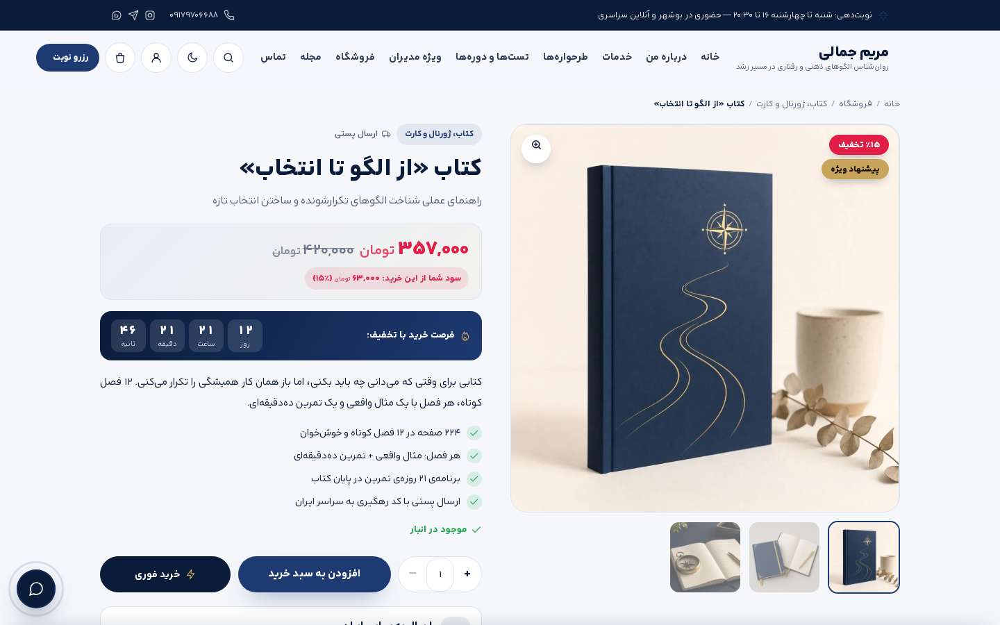
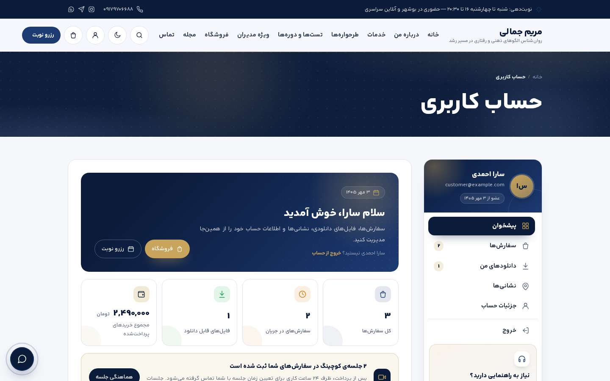
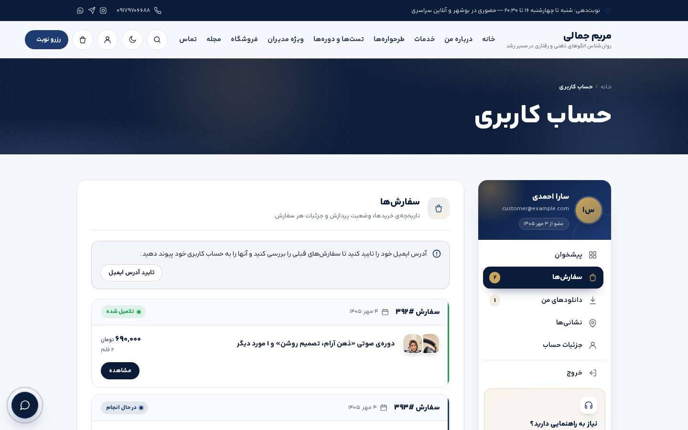
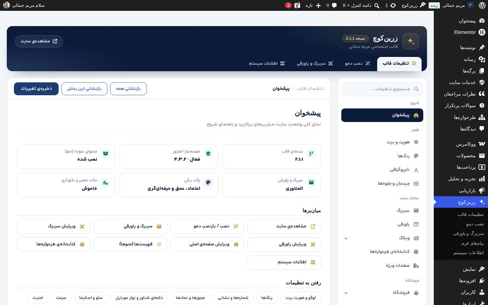
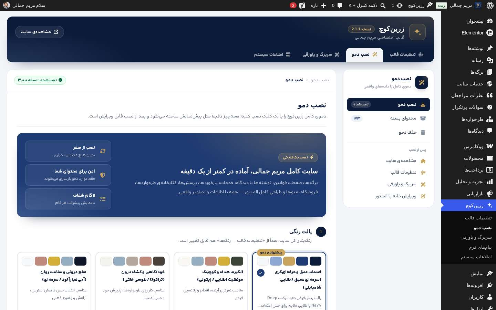
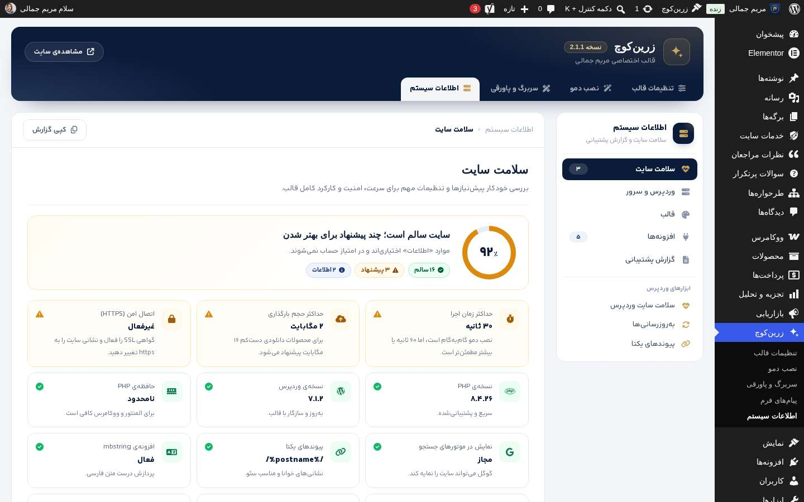
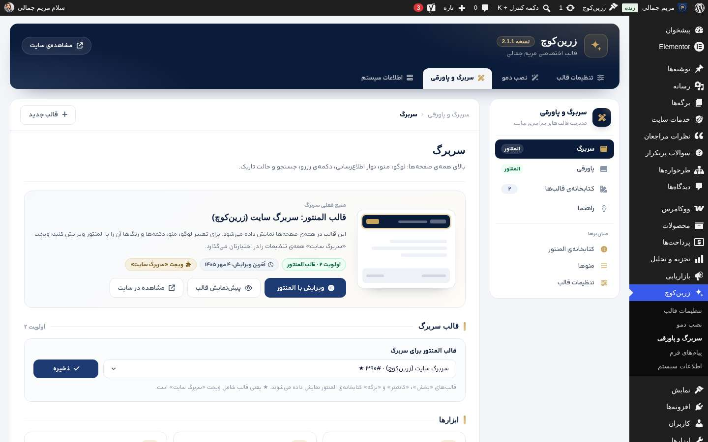

# زرین‌کوچ (ZarinCoach) — قالب وردپرس روان‌شناسی الگوهای ذهنی و رفتاری، کوچینگ و رشد فردی

قالب اختصاصی **مریم جمالی** — [Maryam-Jamali.ir](https://maryam-jamali.ir) | طراحی و توسعه: **احسان نادری‌پناه — زرین‌کد ([Zarincode.com](https://zarincode.com))**

نسخه: **۲.۳.۰** | متن دامنه (Text Domain): `zarincoach` | مجوز: [GPL v3 یا بالاتر](LICENSE)

[](CHANGELOG.md)
[](https://github.com/Ehsan-Np/zarincoach/actions/workflows/ci.yml)
[](#۲-نیازمندیها)
[](#۲-نیازمندیها)
[](#۵-ویجتهای-اختصاصی-المنتور-۵۲-ویجت)
[](#فروشگاه-ووکامرس-نسخهی-۲)
[](LICENSE)

> 📦 **دریافت نسخه‌ی قابل نصب:** از بخش [Releases](https://github.com/Ehsan-Np/zarincoach/releases) فایل `zarincoach-X.Y.Z.zip` را دریافت کنید (برای هر تگ به‌صورت خودکار ساخته می‌شود).
> 📝 **تغییرات نسخه‌ها:** [CHANGELOG.md](CHANGELOG.md)

<p align="center">
  
</p>

<details>
<summary><b>🖼️ گالری تصاویر (سایت، فروشگاه، حساب کاربری، مدیریت)</b></summary>

| | |
|---|---|
|  |  |
| صفحه‌ی نخست — حالت تاریک | صفحه‌ی رزومه |
|  |  |
| فروشگاه | صفحه‌ی محصول |
|  |  |
| حساب کاربری — پیشخوان | حساب کاربری — سفارش‌ها |
|  |  |
| پنل تنظیمات قالب | نصب دمو |
|  |  |
| اطلاعات سیستم | سربرگ و پاورقی |

<p align="center">
  
  &nbsp;
  
</p>

</details>

### فهرست مطالب

۱. [معرفی](#۱-معرفی) · ۲. [نیازمندی‌ها](#۲-نیازمندیها) · ۳. [نصب](#۳-نصب) · ۴. [پنل تنظیمات](#۴-پنل-تنظیمات-redux-framework) · ۵. [ویجت‌های المنتور](#۵-ویجتهای-اختصاصی-المنتور-۵۲-ویجت) · ۶. [انواع نوشته](#۶-انواع-نوشته-اختصاصی) · ۷. [شورت‌کدها](#۷-شورتکدها) · ۸. [فونت](#۸-فونت) · ۹. [عملکرد](#۹-نکات-عملکرد-performance) · ۱۰. [سئو و اسکیما](#۱۰-سئو-و-اسکیما) · ۱۱. [توسعه](#۱۱-توسعه-tailwind-css) · ۱۲. [ساختار پوشه‌ها](#۱۲-ساختار-پوشهها) · ۱۳. [تغییرات نسخه‌ها](#۱۳-تغییرات-نسخهها) · ۱۴. [پشتیبانی](#۱۴-پشتیبانی)

---

## ۱. معرفی

زرین‌کوچ یک قالب وردپرسی **کاملاً راست‌چین (RTL)** و **کاملاً واکنش‌گرا** است که با محوریت
«کوچینگ و توسعه فردی / طرحواره‌درمانی» طراحی شده است. هدف اصلی در توسعه‌ی این قالب سه چیز بوده:

1. **طراحی متمایز و انسانی** — هویت بصری گرم و مینیمال با امضای اختصاصی (برشِ گوشه‌ی کارت‌ها، بافت کاغذیِ بسیار سبک، اشکال ارگانیکِ رنگی و اعدادِ توخالی).
2. **سرعت بسیار بالا** — دارایی‌های پایه‌ی هر صفحه فقط یک فایل CSS (حدود ۳۰ کیلوبایت فشرده)، یک فایل جاوااسکریپت خالص بدون jQuery (حدود ۹ کیلوبایت فشرده) و یک فونت متغیر ۴۸ کیلوبایتی است؛ استایل و اسکریپت فروشگاه فقط در صفحات فروشگاهی بارگذاری می‌شود.
3. **سئوِ ساختاریافته** — سیستم سئو و اسکیمای داخلی (Person / ProfessionalService / FAQPage / OfferCatalog / BreadcrumbList / Product …) بدون نیاز به افزونه، با پل کامل برای Yoast SEO Premium.

---

## ۲. نیازمندی‌ها

| مورد | حداقل | توصیه‌شده | آزموده با |
|---|---|---|---|
| وردپرس | ۶.۰ | ۶.۵+ | ۷.۱.۲ |
| PHP | ۷.۴ | ۸.۱+ | ۸.۴ (سازگاری ۷.۴ تا ۸.۴ با PHPCompatibility بررسی شده) |
| MySQL / MariaDB | ۵.۷ / ۱۰.۳ | ۸.۰ / ۱۰.۶+ | MariaDB |
| المنتور | ۳.۵ | آخرین نسخه (اختیاری اما توصیه‌شده) | ۴.۳.۲ |
| المنتور پرو | — | اختیاری؛ کاملاً سازگار (قالب‌ساز، جایگاه‌ها و ویجت‌های ووکامرس پرو) | ۴.۳.۰ |
| ووکامرس | ۸.۰ | آخرین نسخه (اختیاری؛ برای فروشگاه) | ۱۱.۱.۲ |
| Yoast SEO / Premium | ۲۰.۰ | اختیاری؛ پل اسکیما و مسیر راهنما (بدون تداخل) | ۲۸.۵ |

---

## ۳. نصب

1. فایل `zarincoach.zip` (یا `zarincoach-X.Y.Z.zip` از بخش [Releases](https://github.com/Ehsan-Np/zarincoach/releases)) را از پیشخوان وردپرس ← نمایش ← پوسته‌ها ← افزودن پوسته ← بارگذاری پوسته، آپلود و فعال کنید.
2. (توصیه‌شده) افزونه‌ی **Elementor** را نصب و فعال کنید.
3. به **زرین‌کوچ ← نصب دمو** بروید، پالت رنگی را انتخاب کنید (پیش‌فرض: **سرمه‌ای عمیق / طلایی**) و روی **نصب دمو** بزنید.
   روی سایت تازه، دمو هنگام فعال‌سازی قالب به صورت خودکار نصب می‌شود.
4. به منوی **تنظیمات قالب** بروید و اطلاعات تماس، متن‌ها و تصاویر خود را جایگزین کنید.
5. برای ویرایش بصری هر صفحه، روی **ویرایش با المنتور** کلیک کنید.

### دموی یک‌کلیکی — چه چیزی نصب می‌شود؟

دمو بر اساس **اطلاعات واقعی مریم جمالی** ساخته شده است: کارشناس ارشد روان‌شناسی بالینی، پروانه اشتغال ۲۸۸۵۸، کد نظام روان‌شناسی ۷۰۷۶۳؛
روان‌شناس الگوهای ذهنی و رفتاری در مسیر رشد (جایگاه کوچینگ/آموزشی، بدون ادعای خدمات درمانی بالینی).

| مورد | جزئیات |
|---|---|
| **تماس** | رزرو نوبت ۰۹۱۷۹۷۰۶۶۸۸ · تلفن مطب ۰۹۹۱۴۱۴۲۰۷۰ · ایمیل info@maryam-jamali.ir · اینستاگرام و تلگرام `Maaryam_jamali` · بله `admin_maryamjamali` · شنبه تا چهارشنبه ۱۶:۰۰ تا ۲۰:۳۰ |
| **نشانی دقیق** | بوشهر، خیابان رئیس‌علی دلواری، حدفاصل چهارراه کشتیرانی و شیلات، روبه‌روی خیابان حافظ و اداره کل بنیاد شهید، ساختمان پزشکان طبیب، طبقه پنجم، واحد ۵۰۳ (+ نقشه OpenStreetMap و مختصات جغرافیایی در اسکیما) |
| **۲۱ تصویر + ۱ فایل PDF** | پرتره، آواتار، کارگاه، اتاق مشاوره و جلسه آنلاین با چهره‌ی واقعی مریم جمالی + تصاویر شاخص (WebP خودکار) + **نشانک سایت** (favicon/لوگوی اسکیما) + ۶ تصویر محصول سرمه‌ای/طلایی + فایل PDF نمونه‌ی محصولات دانلودی |
| **۲۴ برگه** | خانه، درباره من، **رزومه**، خدمات، **طرحواره‌ها و الگوهای ذهنی**، تست‌ها و ارزیابی‌ها، دوره‌ها و کارگاه‌ها، ویژه مدیران، مجله، پرسش‌های پرتکرار، تماس، رزرو نوبت + ۱۲ صفحه قوانین (با ووکامرس) — هر برگه با **عنوان و توضیح سئوی اختصاصی** و نوع اسکیمای درست (AboutPage، ProfilePage، ContactPage، FAQPage، CollectionPage) |
| **۱۲ صفحه قوانین** | قوانین و مقررات، **شرایط خرید، ارسال و مرجوعی کالا** (فقط با ووکامرس: ارسال، ۷ روز انصراف، کالای معیوب، استثنای ماده ۳۸ برای فایل دانلودی، بسته‌ی جلسات)، حریم خصوصی، **کوکی‌ها**، لغو و بازگشت وجه، ضمانت و شکایات، حساب کاربری و دیدگاه‌ها، رضایت‌نامه‌ی آگاهانه، **جلسات آنلاین**، **مالکیت فکری**، اخلاق حرفه‌ای و رازداری، سلب مسئولیت و موارد اضطراری — منطبق با قانون تشکیل سازمان نظام روان‌شناسی و مشاوره (ماده ۵) و نظام‌نامه اخلاق، قانون تجارت الکترونیکی (مواد ۳۳ تا ۳۸، ۵۸، ۵۹، ۶۲، ۷۱، ۷۴)، قانون حمایت از حقوق مصرف‌کنندگان، قانون جرایم رایانه‌ای، قانون حمایت حقوق مؤلفان، قانون حمایت از اطفال و نوجوانان، ماده ۶۴۸ قانون مجازات اسلامی و قوه‌ی قاهره در قانون مدنی؛ با تأکید بر ارائه‌ی خدمات فقط در دامنه‌ی Maryam-Jamali.ir. متن‌ها با نشانه‌های پویا نوشته شده‌اند و مالک، دامنه، پروانه و تماس را از پنل می‌خوانند |
| **کتابخانه‌ی طرحواره‌ها (۴۷ مدخل)** | ۱۸ طرحواره‌ی ناسازگار اولیه در ۵ حوزه، ۱۴ ذهنیت طرحواره‌ای، ۳ سبک مقابله و ۱۲ خطای شناختی؛ هر مدخل با نام انگلیسی و کد، خلاصه، باور مرکزی، نیاز برآورده‌نشده، نشانه‌ها، ریشه‌ها، موقعیت‌های فعال‌ساز، سه پاسخ مقابله‌ای، نمونه‌ی واقعی، پیام سالم و تمرین — با برگه‌ی مرکزی فیلتردار و جستجوی فارسی، بایگانی هر گروه و اسکیمای DefinedTerm / DefinedTermSet |
| **۲۴ صفحه + ۲ قالب المنتور** | همه‌ی برگه‌ها، سربرگ و پاورقی ۱۰۰٪ با ویجت‌های اختصاصی قالب |
| **۶ نوشته** | ساختار «مفهوم، مثال واقعی، تمرین، قدم بعدی» با ۴ دسته، برچسب و دیدگاه |
| **۶ خدمت** | ارزیابی اولیه و نقشه الگو، از کمال‌گرایی تا اقدام، ذهن مرتب، شناخت طرحواره‌ها، دوره مهارت‌های زندگی، ذهن مدیر — با قیمت، مدت و اسکیمای Service/Offer |
| **۶ نظر واقعی** | نقل‌شده از بخش نظرات کاربران در **دکترتو** با تاریخ ثبت (بدون جزئیات بالینی) و یادداشت شفاف منبع + پیوند به صفحه‌ی دکترتو؛ طبق سیاست گوگل، از نظرات خوداظهار امتیاز ستاره‌ای (AggregateRating) در اسکیما ساخته نمی‌شود |
| **فروشگاه (با ووکامرس)** | ۴ دسته با تصویر؛ ۹ محصول نمونه: کتاب، ژورنال و کارت (فیزیکی، موجودی و وزن)، کارپوشه، برنامه‌ی ۳۰ روزه و دوره‌ی صوتی (دانلودی، ۵ بار دانلود و ۱ سال اعتبار)، جلسه‌ی ارزیابی (متغیر: آنلاین/حضوری) و دو بسته‌ی جلسات؛ تخفیف زمان‌دار، فروش مکمل و جایگزین، ویژگی‌ها، پرسش‌های محصول؛ کد تخفیف `WELCOME15`؛ ناحیه‌ی ارسال ایران (پست پیشتاز + تحویل حضوری)، ارسال رایگان از ۱٬۵۰۰٬۰۰۰ تومان؛ پرداخت کارت‌به‌کارت و در محل؛ تومان بدون اعشار؛ برگه‌ی فروشگاه با ویجت‌های المنتوری و بخش فروشگاه صفحه‌ی نخست |
| **۱۲ پرسش پرتکرار · ۴ منو** | پرسش‌ها با اسکیمای FAQ؛ منوهای اصلی، موبایل، پاورقی و قوانین |

- **نصب از صفر و بدون تکرار:** هر بار نصب ابتدا همه‌ی آثار دموی قبلی (برگه‌ها، نوشته‌ها، خدمات، تصاویر، منوها، دسته/برچسب‌های خالی‌شده، دیدگاه‌ها، قالب‌های المنتور، «سلام دنیا» و برگه‌ی نمونه) را بر اساس نشانه‌ی متا پاک و سپس همه‌چیز را دوباره می‌سازد. تنظیمات پنل به پیش‌فرض بازنشانی و سپس مقادیر دمو اعمال می‌شود؛ **لوگو، کدهای سفارشی، شورت‌کد فرم، شماره پروانه، کد نظام و نمادهای اعتماد حفظ می‌شوند.** نشانک سایتی که خودتان تنظیم کرده‌اید جایگزین نمی‌شود.
- **حذف دمو** همه‌ی موارد بالا را حذف می‌کند (اختیاری: بازنشانی تنظیمات پنل).
- خط فرمان: `wp zarincoach demo install --palette=navy` و `wp zarincoach demo remove --reset-options`
- اگر برگه‌ای هم‌نام با آرشیو خدمات (`/services/`) منتشر شده باشد، همان برگه به جای آرشیو نمایش داده می‌شود.

> ⚠️ **محصولات و قیمت‌های فروشگاه نمونه‌اند**؛ پیش از فروش واقعی، محصولات، قیمت‌ها و فایل‌های دانلودی واقعی خود را جایگزین و شماره کارت/شبا را در «ووکامرس ← تنظیمات ← پرداخت‌ها ← کارت به کارت» وارد کنید. قیمت جلسات را طبق تعرفه‌ی مصوب سال جاری سازمان نظام تنظیم کنید.

> ⚠️ مختصات جغرافیایی مطب (۲۸٫۹۷۷۷۸، ۵۰٫۸۳۹۳۰) از روی نشانی و نقشه تخمین زده شده است؛ پس از تأیید محل دقیق روی نقشه، در «تنظیمات قالب ← سئو ← کسب‌وکار محلی» اصلاح کنید. متن صفحات قوانین نمونه‌ی حرفه‌ای است و بهتر است توسط مشاور حقوقی بازبینی شود.

## ۴. پنل تنظیمات (Redux Framework)

از نسخه‌ی ۱.۹ پنل تنظیمات و بخش مدیریتی قالب **در یک منوی واحد به نام «زرین‌کوچ»** قرار دارند:

| زیرمنو | کاربرد |
|---|---|
| **تنظیمات قالب** | پنل Redux بازطراحی‌شده |
| **نصب دمو** | نصب/بازنشانی/حذف دموی یک‌کلیکی و انتخاب پالت |
| **سربرگ و پاورقی** | قالب‌های المنتور سربرگ و پاورقی سایت |
| **مدیریت ویجت‌ها** | روشن/خاموش‌کردن ویجت‌های المنتور، نقشه‌ی استفاده و راهنما |
| **پیام‌های فرم** | صندوق پیام‌های فرم تماس |
| **اطلاعات سیستم** | نسخه‌ها، محدودیت‌ها و وضعیت دمو |

Redux به صورت **توکار (Embedded)** در قالب قرار دارد و نیازی به نصب افزونه نیست.

**ویژگی‌های پنل:**

- کاملاً راست‌چین (RTL) و با **فونت آراد**. پوسته‌ی پیش‌فرض Redux حذف شده و ظاهر پنل با رنگ‌های سرمه‌ای قالب هماهنگ است.
- ستون کناری گروه‌بندی‌شده دارد و در موبایل به صورت دکمه‌ای نمایش داده می‌شود.
- **جستجوی زنده‌ی فارسی** در همه‌ی تنظیمات (کلید `/`). بخش‌های دارای نتیجه در منو برجسته می‌شوند.
- **نوار ذخیره‌ی چسبان** دارای مسیر بخش فعلی، «بازنشانی این بخش» و «بازنشانی همه» است. در موبایل، دکمه‌ی ذخیره در پایین صفحه ثابت می‌ماند.
- در **حالت المنتور**، گزینه‌هایی که المنتور آن‌ها را کنترل می‌کند خودکار پنهان می‌شوند. در **حالت کلاسیک**، گزینه‌های مخصوص المنتور پنهان می‌شوند.
- شمارنده‌ی نویسه برای عنوان و توضیح سئو دارد.
- گزینه‌های وابسته فقط وقتی نمایش داده می‌شوند که گزینه‌ی اصلی فعال باشد.

| گروه | بخش‌ها |
|---|---|
| **شروع** | پیشخوان: وضعیت سایت، میان‌برها و راهنما |
| **ظاهر** | هویت و برند (لوگو، فاوآیکن، رنگ نوار مرورگر، برندسازی صفحه‌ی ورود) · رنگ‌ها (۴ پالت یا سفارشی) · تایپوگرافی (آراد، اندازه، ارتفاع خط، متن تراز) · چیدمان و جلوه‌ها (عرض، فاصله‌ی بخش‌ها، انحنا، حالت تاریک، انیمیشن) |
| **ساختار سایت** | سربرگ · پاورقی · وبلاگ (بایگانی، صفحه‌ی مقاله، فهرست مطالب، اشتراک‌گذاری، دیدگاه‌ها) · کتابخانه‌ی طرحواره‌ها (فهرست، مدخل قبلی/بعدی، مرتبط‌ها، یادداشت آموزشی، فراخوان پایانی) · صفحات ویژه (۴۰۴، حالت تعمیر، اعلان کوکی) |
| **اطلاعات و ارتباط** | اطلاعات تماس (دو تلفن، نشانی، ساعات کاری، نقشه) · شبکه‌های اجتماعی · حقوقی و نمادها · ارتباط سریع (دکمه‌ی شناور، کانال‌ها، موقعیت) |
| **فنی** | سئو (هویت حرفه‌ای، صفحه‌ی اصلی، کسب‌وکار محلی) · سرعت (بهینه‌سازی عمومی، المنتور، پیشخوان و پایگاه داده) · امنیت · المنتور (نمایش ویجت‌ها در ویرایشگر) · کدهای سفارشی · پشتیبان‌گیری و انتقال |

### پالت‌های رنگی

- **اعتماد، عمق و حرفه‌ای‌گری** (پیش‌فرض دمو): سرمه‌ای عمیق `#0B1B3A` + سرمه‌ای `#1D3A72` + طلایی شامپاینی `#C9A45C` + آبی مه‌آلود `#8DA9D4`
- **انگیزه، هدف و کوچینگ موفقیت**: خردلی/طلایی مات `#D4AF37` + زیتونی تیره `#3B4436` + استخوانی `#FAF9F6`
- **خودآگاهی و کشف درون**: کاکائویی/تراکوتا `#C08A7C` + طوسی-کرم `#B5A89E` + سفید استخوانی `#F5F5F0`
- **صلح درونی و سلامت روان**: آبی غبارآلود `#95AEC2` + سرمه‌ای `#0F172A` + طوسی روشن `#E5E7EB`

---

## ۵. ویجت‌های اختصاصی المنتور (۵۲ ویجت)

در ویرایشگر المنتور، دسته‌ی **«زرین‌کوچ — مریم جمالی»** را جستجو کنید:

هر ویجت از **کیت استایل زرین‌کوچ** بهره می‌برد: در تب «استایل» همه‌ی اجزا (عنوان، متن، جعبه، دکمه، آیکون، تصویر و…) کنترل کامل رنگ و تایپوگرافی و فاصله دارند، هر جزء اختیاری یک **کلید نمایش/پنهان** دارد و هر نمونه‌ی ویجت یک **پالت رنگ ۱۱کلیدی مستقل** سازگار با حالت تاریک می‌پذیرد. فعال/غیرفعال‌کردن کلی ویجت‌ها هم از پیشخوان ← زرین‌کوچ ← **مدیریت ویجت‌ها** انجام می‌شود؛ ویجت غیرفعالِ بدون استفاده اصلاً بارگذاری نمی‌شود.

| ویجت | slug | کاربرد |
|---|---|---|
| سربرگ اصلی | `zc-hero` | دو ستونه یا میانی، با آمار و کارت‌های شناور |
| سربرگ بخش | `zc-heading` | برچسب + عنوان + زیرعنوان با واژه‌ی رنگی |
| درباره من | `zc-about` | تصویرِ بُرش‌خورده + نشان تجربه + فهرست ویژگی‌ها |
| خدمات و برنامه‌ها | `zc-services` | اتصال به نوعِ نوشته‌ی خدمات یا ورود دستی |
| طرحواره‌ها | `zc-schema` | کارت‌های شماره‌دارِ توخالی + باکس دعوت به ارزیابی |
| کتابخانه‌ی طرحواره‌ها | `zc-schemas` | همه‌ی مدخل‌ها به تفکیک گروه، دکمه‌های فیلتر، جستجوی زنده‌ی فارسی (ی/ک عربی، نیم‌فاصله، واژه‌های محاوره‌ای)، پیوند مستقیم با # و اسکیمای DefinedTermSet |
| مسیر همراهی | `zc-process` | جدول زمانی عمودی با دایره‌های پالس‌دار |
| آمار و ارقام | `zc-stats` | شمارنده‌ی انیمیشنی (با ارقام فارسی) |
| تجربه مراجعان | `zc-testimonials` | شبکه‌ای یا اسلایدر (۱ تا ۳ نظر در هر نما برای دسکتاپ/تبلت/موبایل، دکمه‌های قبلی/بعدی، صفحه‌بندی، پخش خودکار، چرخش پیوسته، سوایپ و صفحه‌کلید) + امتیاز ستاره‌ای |
| بسته‌های همراهی | `zc-pricing` | جدول قیمت با بسته‌ی ویژه و برچسب |
| پرسش‌های پرتکرار | `zc-faq` | آکاردئون + اسکیمای خودکار FAQPage |
| فراخوان اقدام | `zc-cta` | پنل بزرگ با فرم رزرو |
| آخرین نوشته‌ها | `zc-posts` | ۴ طرح کارت (عمودی، افقی، تصویرزمینه، فشرده)، چیدمان مجله‌ای (نوشته‌ی شاخص + فهرست کناری)، نسبت تصویر، نمایش دسته/نویسنده/متا، نوار دسته‌ها، صفحه‌بندی عددی یا دکمه «نوشته‌های بیشتر» بدون بارگذاری مجدد |
| اطلاعات تماس | `zc-contact` | فهرست تماس + نقشه‌ی تنبل |
| نوار کلمات | `zc-marquee` | نوار لغزنده‌ی کلیدواژه‌ها |
| فهرست ویژگی‌ها | `zc-list` | تیک‌دار / خط‌تیره / کارتی |
| فرم رزرو/تماس | `zc-form` | فرم داخلی یا شورت‌کد دلخواه |
| سربرگ سایت (هدر) | `zc-site-header` | نوار بالا، لوگو، منو (انتخاب منو)، جستجو، حالت تیره، دکمه اقدام، منوی کشویی؛ چیدمان کلاسیک/وسط/مینیمال |
| پاورقی سایت (فوتر) | `zc-site-footer` | معرفی و شبکه‌ها، ستون خدمات و نوشته‌ها، راه‌های ارتباط، منوی پاورقی، کپی‌رایت، نوار اعتماد (دامنه رسمی، پروانه، ۱ تا ۶ نماد قابل مدیریت) |
| پانوشت: درباره من | `zc-footer-about` | نام/لوگو، متن معرفی و شبکه‌های اجتماعی (جزء مستقل پانوشت) |
| پانوشت: لوکیشن و راه‌های ارتباط | `zc-footer-location` | تلفن‌ها، ایمیل، نشانی، ساعات کاری و نقشه — هر ردیف مستقل |
| پانوشت: منوها | `zc-footer-menu` | فهرست وردپرس، خدمات یا نوشته‌ها با عنوان و چیدمان دلخواه |
| پانوشت: دامنه رسمی و مجوزها | `zc-footer-domain` | اعلان دامنه رسمی، هشدار اورژانس و مجوزها |
| پانوشت: نمادهای اعتماد | `zc-footer-trust` | نمادهای فشرده برای پانوشت با ۵ طرح نمایش |
| پانوشت: منوی قوانین | `zc-footer-nav` | ردیف پیوندهای قوانین و مقررات با چینش دلخواه |
| پانوشت: کپی‌رایت | `zc-footer-copyright` | خط جداکننده، کپی‌رایت و اعتبار طراح |
| هدر: نوار اطلاع‌رسانی | `zc-header-topbar` | آیکن و متن/پیوند اطلاعیه، تلفن و شبکه‌های اجتماعی — هر جزء مستقل |
| هدر: لوگو و برندینگ | `zc-header-brand` | هویت سایت، تصویر دلخواه (با نسخه تیره) یا نام/توضیح دلخواه |
| هدر: منوی اصلی | `zc-header-menu` | فهرست دلخواه با زیرمنو، چینش و استایل کامل آیتم‌ها و زیرمنو |
| هدر: جستجو | `zc-header-search` | دکمه با آیکن دلخواه + پنل بازشو با فرم قابل‌ویرایش |
| هدر: کلید حالت تاریک | `zc-header-dark` | آیکن‌های جدا برای حالت روشن و تاریک |
| هدر: حساب و سبد خرید | `zc-header-cart` | ورود/عضویت و سبد با نشان تعداد (ووکامرس) |
| هدر: دکمه‌ی فراخوان و تلفن | `zc-header-cta` | دکمه با متن/پیوند/آیکن/اندازه دلخواه + چیپ تلفن |
| هدر: دکمه‌ی منوی موبایل | `zc-header-burger` | دکمه‌ی همبرگری با رنگ خطوط و نمایش اختیاری در دسکتاپ |
| هدر: منوی کشویی موبایل | `zc-header-drawer` | برند، فهرست، دکمه، تلفن‌ها، ایمیل و شبکه‌های اجتماعی |
| هدر: نوار پیشرفت مطالعه | `zc-header-progress` | نوار باریک پایین هدر که با اسکرول پر می‌شود |
| مسیر راهنما (Breadcrumb) | `zc-breadcrumb` | بردکامب مستقل با آیکن خانه، جداکننده و قاب اختیاری |
| عنوان برگه | `zc-page-title` | عنوان/چکیده‌ی پویای برگه + مسیر راهنما، تُن سرمه‌ای/روشن، سه ارتفاع |
| متن و محتوا | `zc-text` | ویرایشگر متن با تایپوگرافی قالب، عرض خوانا، کارت، تاریخ به‌روزرسانی، فهرست مطالب کناری یا درون متن با همه‌ی تنظیمات طراحی |
| فهرست مطالب | `zc-toc` | ساخت خودکار از تیترهای متن یا کل صفحه (یا انتخابگر دلخواه)، سطح تیترها، ۱ تا ۴ ستون، سبک کارت/ملایم/سرمه‌ای/مینیمال، شماره‌گذاری ساده/سلسله‌مراتبی/نقطه، جمع‌شونده، نوار پیشرفت، بخش فعال هنگام اسکرول، دکمه شناور |
| نمادهای اعتماد | `zc-trust-badges` | ۱ تا ۶ نماد: اینماد، ساماندهی، درگاه زرین‌پال، درگاه پی، نظام روان‌شناسی یا نماد دلخواه؛ کد رسمی/تصویر و لینک/طرح پیش‌فرض، ۵ سبک، چیدمان دوستونه یا زیرهم، توضیح هر نماد، حالت خاکستری |
| رزومه — معرفی حرفه‌ای | `zc-resume-hero` | نام، مدرک، خلاصه، برچسب‌ها، تصویر با نشان پروانه، کارت‌های مدارک با لینک استعلام، آمار، دکمه چاپ/PDF، ناوبری چسبان بخش‌ها با اسکرول‌اسپای و اسکیمای ProfilePage |
| حوزه‌های تخصصی | `zc-skills` | کارت‌های شماره‌دار با آیکن، توضیح، برچسب‌ها و لینک |
| معرفی کتاب | `zc-book` | جلد سه‌بعدیِ ساخته‌شده با CSS (یا تصویر جلد)، نویسنده، معرفی، ویژگی‌ها و دکمه |
| خط زمانی سوابق | `zc-timeline` | خط زمانی یک‌ستونه یا دوطرفه، برچسب «هم‌اکنون»، سازمان، بازه‌ی زمانی و توضیح |
| دوره‌ها و گواهی‌ها | `zc-courses` | خلاصه‌ی خودکار (مجموع ساعت، تعداد دوره، تعداد مراجع)، فیلتر دسته‌ها، دوره‌ی ویژه، نوار نسبت ساعت، کارت «+ دوره‌های دیگر» |

### صفحه رزومه

برگه‌ی «رزومه مریم جمالی» (`/resume/`) با پنج ویجت بالا ساخته می‌شود: مدرک کارشناسی ارشد روان‌شناسی بالینی، شماره پروانه اشتغال ۲۸۸۵۸ و کد نظام ۷۰۷۶۳ (با لینک استعلام در pcoiran.ir)، کتاب «راهنمای تشخیص و درمان اختلالات شخصیت»، سمت‌ها، ۸ سابقه‌ی کاری و ۱۴ دوره‌ی تخصصی. نسخه‌ی چاپی (دکمه «چاپ / ذخیره PDF») روشن و بدون سربرگ، پاورقی و دکمه‌ها است. شماره پروانه، کد نظام و مدرک از بخش «اطلاعات حقوقی» پنل تنظیمات هم در پاورقی و صفحات قوانین نمایش داده می‌شوند.

### سربرگ و پاورقی با المنتور (بدون نیاز به المنتور پرو)

۱. **زرین‌کوچ ← سربرگ و پاورقی**: صفحه‌ی اختصاصی که منبع فعلی سربرگ و پاورقی را نشان می‌دهد (المنتور پرو / قالب المنتور / داخلی). از همین صفحه می‌توانید قالب را با المنتور ویرایش یا پیش‌نمایش کنید و قالب دیگری انتخاب کنید. ساخت یا بازسازی قالب پیش‌فرض و بازگشت به نسخه‌ی داخلی هم با یک کلیک انجام می‌شود. کتابخانه‌ی قالب‌ها با دکمه‌ی «سربرگ شود / پاورقی شود» و یک راهنما نیز در همین صفحه است.
۲. همین انتخاب از **تنظیمات قالب ← سربرگ ← قالب المنتور سربرگ** و **تماس و پاورقی ← قالب المنتور پاورقی** هم در دسترس است (خالی = سربرگ/پاورقی داخلی قالب).
۳. در صورت نصب المنتور پرو، مکان‌های Theme Builder (header/footer) نیز پشتیبانی می‌شوند.
۴. هر برگه‌ی المنتوری که ویجت «عنوان برگه» داشته باشد، سربرگ پیش‌فرض قالب را نمایش نمی‌دهد.
۵. قالب‌های تک‌نوشته، بایگانی، جستجو و ۴۰۴ با PHP قالب ساخته می‌شوند (سازنده‌ی قالب این صفحات فقط در المنتور پرو وجود دارد) و از همان سربرگ/پاورقی المنتوری استفاده می‌کنند.

تمام ویجت‌ها دارای **برگه‌ی تنظیمات سبک** (رنگ، اندازه، فاصله) هستند و در صورت خالی گذاشتنِ
هر فیلد، مقدارِ متناظر از **پنل تنظیمات قالب** خوانده می‌شود.

---

### فروشگاه ووکامرس (نسخه‌ی ۲)

- **۵ ویجت فروشگاهی المنتور:** محصولات (شبکه/اسلایدر، منبع: جدید، ویژه، تخفیف‌دار، پرفروش، دسته یا دستی)، دسته‌های محصول (کاشی تصویری/کارت)، معرفی ویژه‌ی یک محصول (با شمارش معکوس تخفیف)، بنر تخفیف با کد قابل کپی و شمارش معکوس، مزایای خرید.
- **کارت محصول حرفه‌ای:** نشان درصد تخفیف، «تازه»، نشان سفارشی، نوع تحویل (فیزیکی/دانلودی/جلسه)، افزودن سریع به سبد با AJAX.
- **صفحه‌ی محصول:** گالری، قیمت با «سود شما از این خرید»، شمارش معکوس پایان تخفیف، ویژگی‌ها، هشدار موجودی کم، دکمه‌ی «خرید فوری»، باکس نحوه‌ی تحویل، نشان‌های اعتماد قابل تنظیم، اشتراک‌گذاری، تب‌های معرفی/مشخصات/پرسش‌ها/دیدگاه خریداران، نوار چسبان افزودن به سبد در موبایل، محصولات مرتبط/مکمل.
- **بایگانی:** سربرگ و مزایا، فیلتر کناری (دسته، نوع محصول، بازه‌ی قیمت، تخفیف‌دار، موجود) و نسخه‌ی کشویی موبایل.
- **سبد و تسویه:** کشوی سبد خرید، نوار پیشرفت ارسال رایگان، فرم کوتاه برای سبد مجازی، اعتبارسنجی موبایل و کد پستی ۱۰ رقمی ایران (ارقام فارسی خودکار تبدیل می‌شوند)، ترتیب فیلدهای ایرانی، تاریخ شمسی در سفارش‌ها، لغو خودکار سفارش کارت‌به‌کارت پرداخت‌نشده پس از ۴۸ ساعت (قابل تنظیم)، واحدهای فارسی.
- **المنتور پرو:** اگر قالب محصول/بایگانی با قالب‌ساز پرو ساخته شود، همان جایگزین قالب داخلی می‌شود و ویجت‌های ووکامرس پرو هم‌رنگ قالب‌اند.
- **حساب کاربری (نسخه‌ی ۲.۱):** پیشخوان اختصاصی با خوشامد، آمار (سفارش‌ها، در جریان، دانلودها، مجموع خرید)، آخرین سفارش‌ها و دسترسی سریع. کارت سفارش‌ها با تصویر محصول و وضعیت رنگی را هم دارد. صفحه‌ی جزئیات سفارش مراحل پیشرفت، اطلاعات کارت‌به‌کارت و به‌روزرسانی‌ها را نشان می‌دهد. کتابخانه‌ی فایل‌های دانلودی، نشانی‌ها و فرم ورود/عضویت زبانه‌ای هم طراحی شده‌اند. همه‌ی بخش‌ها حالت تاریک و موبایل دارند.
- اگر برگه‌های سبد/تسویه بلوکی باشند، در پیشخوان پیشنهاد تبدیل یک‌کلیکی به نسخه‌ی کلاسیک نمایش داده می‌شود.

## ۶. انواع نوشته اختصاصی

| نوع نوشته | slug | توضیح |
|---|---|---|
| خدمات | `zc_service` | آیکون، قیمت، مدت‌زمان، برچسب و ترتیب نمایش |
| تجربه مراجعان | `zc_testimonial` | نام، نقش و امتیاز (۱ تا ۵) |
| پرسش‌های پرتکرار | `zc_faq` | پرسش (عنوان) و پاسخ (محتوا) |
| پیام‌های فرم | `zc_message` | ذخیره‌ی امن پیام‌های ارسالی (خصوصی) |
| طرحواره‌ها و الگوهای ذهنی | `zc_schema` | نشانی `/schemas/{slug}/`، ۱۵ فیلد ساختاریافته (جعبه‌ی «مشخصات طرحواره»)، رده‌بندی سلسله‌مراتبی `zc_schema_group` با نشانی `/schema-group/…` |

---

## ۷. شورت‌کدها

```text
[zc_contact]                       فرم تماس/رزرو داخلی
[zc_contact title="..." button="..." show_subject="1"]
[zc_info field="domain|owner|license|license_label|phone|email|address|hours|emergency" link="1"]
                                   درج اطلاعات پنل در متن (با تغییر پنل همه‌جا به‌روز می‌شود)
[zc_link page="refund-policy" text="..."]  پیوند به برگه‌های دمو بر اساس کلید (مستقل از پیوند یکتا)
[zc_schemas]                       کتابخانه‌ی کامل طرحواره‌ها با فیلتر و جستجو
```

فرم دارای: بررسی nonce، فیلد مخفیِ ضدربات، محدودیت ارسال (۳۰ ثانیه)، پاک‌سازی ورودی‌ها،
ارسال ایمیل و ذخیره در پیشخوان.

---

## ۸. فونت

فونت **آراد (Arad) نسخه‌ی متغیر** — ادامه‌ی پروژه‌ی شبنم — به صورت **داخلی (Self-hosted)** بارگذاری می‌شود:

- `assets/fonts/Arad-VF.woff2` — ۴۸ کیلوبایت (وزن ۱۰۰ تا ۹۰۰)
- `assets/fonts/AradFD-VF.woff2` — نسخه با ارقام فارسی

هیچ درخواستی به گوگل فونتز یا منبع خارجی ارسال نمی‌شود و فونت با `preload` زودتر بارگیری می‌گردد.

---

## ۹. نکات عملکرد (Performance)

- **CSS:** یک فایل Tailwind (`main.css`، ~۳۰KB با gzip)؛ CSS پویا inline در `<head>`. استایل فروشگاه (`shop-core.css` ~۳KB، `shop.css` ~۱۲KB و `account.css` ~۷KB با gzip) فقط در صفحات ووکامرس، حساب کاربری و صفحاتی که ویجت فروشگاهی دارند بارگذاری می‌شود
- **JS:** یک فایل خالص و فشرده با terser (`main.min.js` ~۲۹KB / ~۹KB با gzip، بدون jQuery، `defer`)؛ `shop.min.js` (~۴KB با gzip) فقط در صفحات فروشگاهی؛ در برگه‌های المنتور، اسکریپت‌ها و استایل‌های اضافه‌ی المنتور برای بازدیدکننده بارگذاری نمی‌شوند (مدیر سایت همه را دارد)
- **فونت:** فقط **یک** فایل woff2 آراد (نسخه‌ی ارقام فارسی یا لاتین) با preload و `font-display: swap`
- **تصاویر:** srcset/sizes دقیق، اندازه‌های نیم‌عرض، WebP خودکار برای اندازه‌های فرعی، `fetchpriority="high"` فقط برای تصویر LCP، ابعاد صریح برای جلوگیری از CLS
- **بلوک‌ها:** به‌جای فایل کامل block-library (~۱۳۷KB) فقط استایل همان بلوک‌هایی که در نوشته استفاده شده بارگذاری می‌شود
- **پیش‌واکشی:** قوانین حدس‌زنی بومی وردپرس (Speculation Rules، حالت prefetch/moderate) + جایگزین سبک برای مرورگرهای قدیمی فقط با هاور/لمس
- **CLS صفر** در همه‌ی برگه‌های دمو (فهرست مطالب موبایل از همان نقاشی اول بسته است)
- حذف بار اضافی هسته (ایموجی، oEmbed، jQuery Migrate، Dashicons، الگوهای بلوکی، heartbeat برای مهمان، متاتگ‌های generator)
- همه قابل کنترل در «تنظیمات قالب ← عملکرد»

---

## ۱۰. سئو و اسکیما

- **عنوان و توضیح متا** هوشمند (جداکننده‌ی قابل انتخاب، شماره‌ی صفحه، حداکثر ۱۵۵ نویسه) + **جعبه‌ی «سئو و اسکیما»** برای هر برگه/نوشته/خدمت: عنوان، توضیح، noindex، canonical و نوع صفحه، با شمارنده و پیش‌نمایش گوگل
- **canonical** یکتا، **robots** استاندارد (noindex برای جستجو، ۴۰۴، برچسب‌ها و بایگانی تاریخ)، **اوپن‌گراف و توییتر** با ابعاد واقعی تصویر، `article:*` و `profile:*`
- **نقشه‌ی سایت** هسته‌ی وردپرس بهینه (بدون کاربران، برچسب‌ها و انواع غیرعمومی؛ با lastmod) و **robots.txt** استاندارد
- ریدایرکت ۳۰۱ صفحات پیوست و نویسنده (جلوگیری از محتوای کم‌ارزش/تکراری)
- **اسکیمای JSON-LD یکپارچه (یک @graph در هر صفحه)** با شناسه‌های پایدار: WebSite + SearchAction، Person (مدرک، پروانه اشتغال با EducationalOccupationalCredential، عضویت نظام روان‌شناسی، حوزه‌های تخصص، sameAs)، ProfessionalService (نشانی، مختصات، ساعات کاری، دو contactPoint، بازه‌ی قیمت)، WebPage با نوع درست، BreadcrumbList، BlogPosting، Service + Offer (ریال)، OfferCatalog، FAQPage، Book و گواهی‌های دوره‌ها
- ویجت‌ها داده‌ی اسکیما را به جمع‌کننده‌ی مرکزی می‌دهند (بدون بلوک تکراری)؛ اعتبارسنجی کامل با واژگان رسمی schema.org
- **اسکیمای محصول استاندارد:** Product / Book / Service با Offer یا AggregateOffer، قیمت به **ریال (IRR)** (تومان نامعتبر است)، StrikethroughPrice، priceValidUntil، موجودی، MerchantReturnPolicy (۷ روز برای کالای فیزیکی)، OfferShippingDetails (هزینه، زمان آماده‌سازی و ارسال)، فقط نظرات واقعی خریداران؛ ItemList در فروشگاه و دسته‌ها؛ داده‌ی ساختاریافته‌ی تکراری ووکامرس حذف می‌شود
- noindex, follow برای سبد، تسویه، حساب کاربری و نشانی‌های فیلتر/مرتب‌سازی؛ OG محصول با `product:price:*`
- **Yoast SEO / Premium:** سئوی داخلی کنار می‌رود و گره‌های قالب (ProfessionalService، Service، Product، FAQ، DefinedTerm…) با شناسه‌های Yoast **در همان گراف Yoast ادغام** می‌شوند؛ مسیر راهنمای Yoast از مسیر راهنمای قالب پیروی می‌کند. در Rank Math / AIOSEO / SEOPress سئوی داخلی خودکار غیرفعال می‌شود

---

## ۱۱. توسعه (Tailwind CSS)

فایل‌های منبع استایل در `src/` و تنظیمات در `tailwind.config.js` قرار دارد. خروجی‌های ساخته‌شده (`assets/css/*.css` و `assets/js/*.min.js`) در مخزن کامیت می‌شوند تا قالب بدون نیاز به Node قابل نصب باشد.

```bash
git clone git@github.com:Ehsan-Np/zarincoach.git wp-content/themes/zarincoach
cd wp-content/themes/zarincoach
npm ci               # نصب دقیق ابزارهای توسعه از روی package-lock.json (Node 20+)
npm run build        # ساخت همه‌ی خروجی‌ها (CSS اصلی + فروشگاه + JS)
npm run watch        # حالت توسعه‌ی CSS اصلی
```

| اسکریپت | کار |
|---|---|
| `npm run build` | اجرای هر سه ساخت زیر |
| `npm run build:css` | `src/tailwind.css` ← `assets/css/main.css` (فشرده) |
| `npm run build:shop` | `src/shop-core.css`، `src/shop.css` و `src/account.css` ← `assets/css/` |
| `npm run build:js` | `assets/js/main.js` و `shop.js` ← نسخه‌های `.min.js` با terser |
| `npm run dev` / `watch` | ساخت غیرفشرده / پایش تغییرات CSS اصلی |

**قواعد مهم:** همه‌ی کلاس‌های قالب با پیشوند `zc-` نام‌گذاری می‌شوند (در safelist تیلویند)؛ رنگ‌ها از متغیرهای `--zc-*-rgb` خوانده می‌شوند تا پالت‌ها و حالت تاریک کار کنند؛ پیشوند حساب کاربری `zc-ma` و فرم ورود `zc-auth` است. `.editorconfig` قواعد تورفتگی را تعیین می‌کند.

### کیفیت کد و CI

هر پوش به `main` و هر Pull Request در GitHub Actions ([`ci.yml`](.github/workflows/ci.yml)) بررسی می‌شود:

- **نحو PHP** در نسخه‌های ۷.۴، ۸.۰، ۸.۱، ۸.۲، ۸.۳ و ۸.۴ (همه‌ی فایل‌ها، از جمله Redux توکار)
- **سازگاری PHP ۷.۴ به بالا** با PHPCompatibility (کد قالب)
- **به‌روز بودن خروجی‌ها:** اجرای `npm ci && npm run build` و مقایسه با فایل‌های کامیت‌شده
- **یکسانی شماره‌ی نسخه** در `style.css`، `functions.php`، `package.json`، `package-lock.json` و `CHANGELOG.md` ([`check-version.sh`](.github/scripts/check-version.sh))
- ساخت زیپ قابل نصب به‌عنوان Artifact

### انتشار نسخه‌ی جدید

1. شماره‌ی نسخه را در `style.css` (`Version`)، `functions.php` (`ZC_VERSION` و `@version`)، `package.json`/`package-lock.json` و README بالا ببرید و بخش تازه را بالای `CHANGELOG.md` بنویسید.
2. `npm run build` و `.github/scripts/check-version.sh` را اجرا کنید.
3. کامیت، تگ و پوش: `git commit -am "vX.Y.Z: …" && git tag vX.Y.Z && git push origin main --tags`
4. گردش‌کار [`release.yml`](.github/workflows/release.yml) خودکار یک Release با `zarincoach-X.Y.Z.zip`، `zarincoach.zip`، `SHA256SUMS.txt` و یادداشت همان نسخه از CHANGELOG می‌سازد. برای تگ‌های قدیمی: Actions ← Release ← Run workflow.

زیپ با `git archive` ساخته می‌شود و فایل‌های توسعه‌ی مخزن (`.github/`، `docs/`، `.gitattributes`، `.gitignore`، `.editorconfig`) طبق `.gitattributes` در آن قرار نمی‌گیرند.

---

## ۱۲. ساختار پوشه‌ها

```text
zarincoach/
├─ style.css, functions.php, theme.json, screenshot.png
├─ index.php, header.php, footer.php, front-page.php, page.php, single.php, archive.php, search.php, 404.php
├─ comments.php, sidebar.php, searchform.php, template-fullwidth.php
├─ single-zc_service.php, archive-zc_service.php, single-zc_schema.php, taxonomy-zc_schema_group.php, single-elementor_library.php
├─ assets/
│  ├─ css/            main.css, shop-core.css, shop.css, account.css  (خروجی Tailwind — ساخته‌شده)
│  ├─ js/             main.js, shop.js + نسخه‌های .min.js (terser)
│  ├─ admin/          panel.css/js (پوسته‌ی پنل Redux)، tools.css/js (نصب دمو، اطلاعات سیستم، سربرگ و پاورقی)
│  ├─ fonts/          Arad-VF.woff2, AradFD-VF.woff2
│  ├─ img/            SVGهای پیش‌فرض (آواتار، فاوآیکن، الگو)
│  └─ demo/           ۲۲ تصویر و فایل نمونه‌ی دمو (چهره‌ی واقعی مریم جمالی، محصولات، PDF نمونه)
├─ inc/
│  ├─ setup.php, enqueue.php, helpers.php, template-tags.php, icons.php, palette.php, dynamic-css.php
│  ├─ admin-shell.php, admin.php, admin-layout.php        نصب دمو، اطلاعات سیستم، سربرگ و پاورقی
│  ├─ options.php, options-fields.php, options-panel.php, options-sections-home.php, options-sections-shop.php
│  ├─ redux-loader.php, redux/                           Redux Framework توکار
│  ├─ admin-panel/                                       اجزای پوسته‌ی پنل
│  ├─ cpt.php, metaboxes.php, schemas.php                انواع نوشته، جعبه‌ها و کتابخانه‌ی طرحواره‌ها
│  ├─ toc.php, share.php, trust-badges.php, contact-form.php, site-tools.php, security.php
│  ├─ seo.php, seo-schema.php, seo-metabox.php, seo-yoast.php   سئو، JSON-LD، جعبه‌ی سئو، پل Yoast
│  ├─ performance.php, performance-elementor.php         بهینه‌سازی سرعت
│  ├─ elementor-home-builder.php                         ساخت صفحات و قالب‌های المنتوری دمو
│  ├─ demo-content.php, demo-data.php, demo-shop.php, demo-legal*.php, demo-schemas*.php   دمو
│  ├─ elementor/{class-zc-elementor.php, class-zc-widget-base.php, widgets/}   ۳۳ ویجت
│  └─ woocommerce/{setup,loop,single,cart,account,admin,seo}.php
├─ template-parts/{front-page/, site-header.php, site-footer.php, page-header.php, page-elementor.php, maintenance.php, content*.php}
├─ woocommerce/{archive-product.php, content-product.php, content-single-product.php, loop/, myaccount/}
├─ languages/zarincoach.pot
├─ src/{tailwind.css, shop-core.css, shop.css, account.css}   منبع استایل‌ها
├─ tailwind.config.js, package.json, package-lock.json
├─ README.md, CHANGELOG.md, LICENSE
├─ .github/{workflows/ci.yml, workflows/release.yml, scripts/check-version.sh}   (خارج از زیپ نصب)
├─ docs/screenshots/                                     (خارج از زیپ نصب)
└─ .gitattributes, .editorconfig, .gitignore
```

---

## ۱۳. تغییرات نسخه‌ها

تاریخچه‌ی کامل همه‌ی نسخه‌ها (۱.۲.۰ تا امروز) در **[CHANGELOG.md](CHANGELOG.md)** است. خلاصه‌ی دو نسخه‌ی اخیر:

**۲.۴.۰** — هدر ویجت‌به‌ویجت

- **۱۰ ویجت مستقل هدر** (نوار اطلاع‌رسانی، لوگو و برندینگ، منوی اصلی، جستجو، حالت تاریک، حساب و سبد، دکمه‌ی فراخوان و تلفن، دکمه‌ی منوی موبایل، منوی کشویی، نوار پیشرفت) + **ویجت مستقل مسیر راهنما (Breadcrumb)** برای برگه‌ها — همه با آیکون‌های دلخواه، کیت استایل کامل و کلیدهای نمایش.
- قالب پیش‌فرض سربرگ حالا با همین ویجت‌ها در المنتور ساخته می‌شود؛ ویجت جامع «سربرگ سایت» و سربرگ داخلی قالب هم fallback هستند.
- گروه «اجزای هدر و برگه‌ها» در مدیریت ویجت‌ها (مجموعاً ۵۲ ویجت اختصاصی).

**۲.۳.۰** — پانوشت ویجت‌به‌ویجت

- **۷ ویجت مستقل پانوشت** (درباره من، لوکیشن، منوها، دامنه رسمی، نمادهای اعتماد، منوی قوانین، کپی‌رایت) — هر جزء با یک کلیک قابل ویرایش، کیت استایل کامل و کلیدهای نمایش.
- قالب پیش‌فرض پاورقی حالا با همین ویجت‌ها در المنتور ساخته می‌شود؛ ویجت جامع «پاورقی سایت» هم پابرجاست.

**۲.۲.۰** — کنترل کامل المنتور

- **کیت استایل زرین‌کوچ** برای هر ۳۳ ویجت: بخش‌های استایل کامل (عنوان/متن/جعبه/دکمه/آیکون/تصویر/فهرست/شبکه/فرم + چیدمان) در تب استایل المنتور.
- **کلید نمایش/پنهان** برای تک‌تک اجزای اختیاری هر ویجت با اعمال زنده در ویرایشگر؛ **پالت رنگ ۱۱کلیدی مستقل** برای هر نمونه‌ی ویجت (سازگار با حالت تاریک).
- **صفحه‌ی «مدیریت ویجت‌ها»** در پیشخوان: کاتالوگ، جستجو و فیلتر، خاموش/روشن گروهی، نقشه‌ی استفاده و راهنما؛ ویجت غیرفعالِ بدون استفاده بارگذاری نمی‌شود.
- کنترل‌های محتوایی تازه در ویجت‌ها (کارت هیرو، آیکون‌ها، برچسب‌ها، تعداد واژه‌ی خلاصه، تگ عنوان، آیکون دکمه) و حذف `!important`های متنی برای آزادی کامل تایپوگرافی.
- **لحن گرم و نیمه‌محاوره‌ای** دمو و بخش دیدگاه‌ها (خطاب «شما»)؛ متن حقوقی رسمی مانده و فقط مقدمه‌ی صمیمی گرفته است.

---

## ۱۴. پشتیبانی

**احسان نادری‌پناه — زرین‌کد** | [Zarincode.com](https://zarincode.com)

© ۲۰۲۶ زرین‌کد — طراحی و توسعه: احسان نادری‌پناه. این قالب تحت مجوز [GNU GPL نسخه‌ی ۳ یا بالاتر](LICENSE) منتشر شده است. Redux Framework (مجوز GPL) و فونت آراد (مجوز OFL) مجوز خود را دارند.
